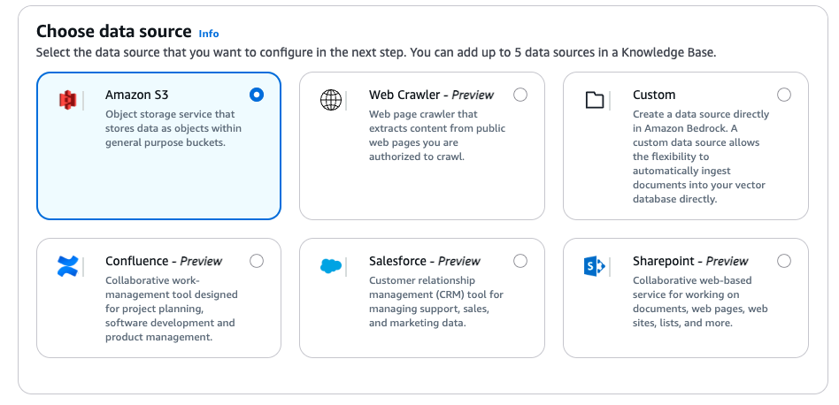
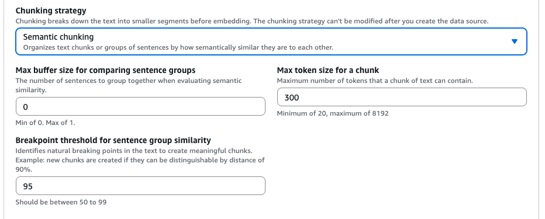
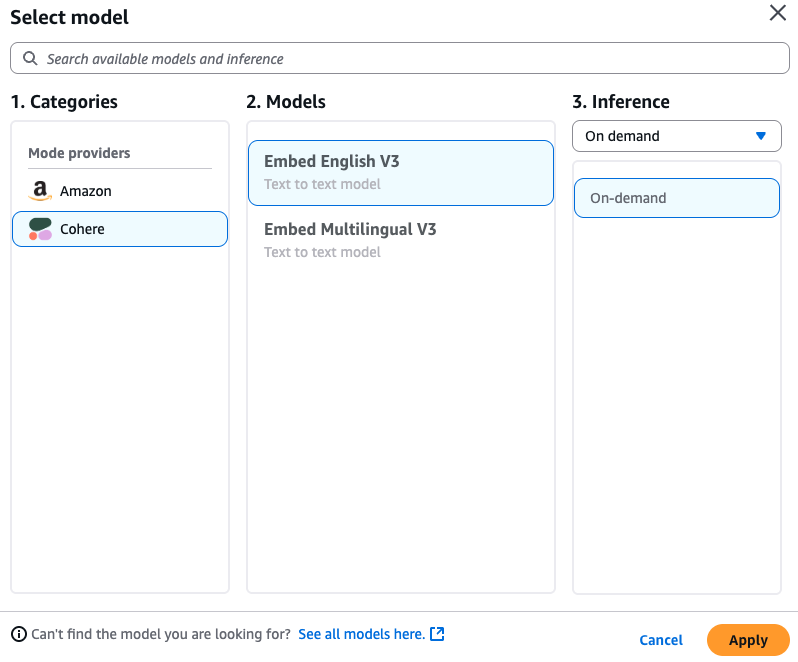

# AI Health Assistant

An AI-powered health assistant with voice interaction capabilities that helps users describe their health concerns and book doctor appointments.

## Features

- **Voice-Based Interaction**: Speak naturally with the AI health assistant
- **Symptom Assessment**: The assistant asks relevant follow-up questions about your symptoms
- **Health Knowledge Base**: Access to curated medical information for symptom guidance
- **Appointment Booking**: Book appointments with doctors based on your schedule preferences
- **Calendar Integration**: Avoid scheduling conflicts with personal calendar events (uses local database mock-up for demonstration)
- **Visual UI**: See available appointment slots and booking confirmations directly in the interface
- **Conversation History**: View your entire conversation with the assistant

## Demo Note

**Important**: This application uses a database-based calendar mock-up for demonstration purposes instead of integrating with real calendar APIs. The personal calendar events and appointment slots are stored in a local SQLite database to showcase the scheduling conflict detection functionality without requiring external calendar service credentials.

In a production environment, the calendar integration would connect to real calendar services (Google Calendar, Outlook, etc.) via their respective APIs. The current implementation demonstrates the conflict detection logic and appointment scheduling workflow using mock data.

## Technical Overview

This project consists of:

1. **Backend Server**: Python-based server using:
   - Pipecat framework for audio processing and AI integration
   - AWS Bedrock Nova Sonic for natural language understanding and voice synthesis
   - AWS Bedrock Knowledge Base for health information retrieval
   - SQLite database for appointment and calendar data storage
   - Daily for audio/video transportation

2. **Frontend Client**: React-based web application using:
   - TypeScript for type safety
   - Pipecat client React components for audio/video interaction
   - Tailwind CSS for styling
   - Custom UI components for displaying conversations, symptom summaries, and appointments

## Prerequisites

- Python 3.8+
- Node.js 16+
- [Daily.co](https://dashboard.daily.co/) API key
- AWS Account with:
   - Bedrock access and model permissions for Amazon Nova Sonic
   - Provisioned [Amazon Bedrock Knowledge Base](https://docs.aws.amazon.com/bedrock/latest/userguide/knowledge-base.html) with health-related content
   - Appropriate IAM permissions for Bedrock services

### Create Bedrock Knowledge Base
Please upload the two files under `"server/data/kb/"` to an S3 bucket.

1. **Access AWS Bedrock Console**
   - Log into your AWS Console
   - Navigate to Amazon Bedrock service
   - Select "Knowledge Bases" from the left navigation menu


2. **Create New Knowledge Base**
   - Click "Create -> Knowledge Base with vector store"
   - Enter a name for your knowledge base (e.g., "Health-Assistant-KB")
   - You can select to create a new service role or use existing service role
   - Choose `Amazon S3` as your data source


3. **Configure Data Source and chunking strategy**
   - Click `Browse S3` to select the S3 location where you have uploaded the two files under the kb folder
   - Then you can select the `Chunking Strategy` as *Semantic chunking* and leave the remaining as default, and then select **Next**


4. **Configure data storage and processing**
   - Choose **Cohere -> Embed English V3** as your embedding model
   - Then select **Next**


5. **Review and Create**
   - Review your configuration settings
   - Click **Create Knowledge Base**
   - Wait for the knowledge base to be created (Do not refresh page or leave page)

6. **Get Knowledge Base ID**
   - Once created, select the Data source and click **Sync** to sync the data source (Note that you need to sync the data source at least once to be able to retrieve data from the knowledge base)

   - copy the Knowledge Base ID
   - Add this ID to your `server/.env` file as `AMAZON_BEDROCK_KB_ID`


> **Note**: The knowledge base creation process may take several minutes depending on the size of your documents.


## Setup

### 1. Clone the Repository
```bash
git clone <repository-url>
cd ai-health-assistant
```

### 2. Environment Configuration
Copy the example environment file and configure your credentials:
```bash
cp server/.env.example server/.env
```

Edit `server/.env` with your API keys and configuration:
```env
DAILY_API_KEY=your_daily_api_key
AWS_ACCESS_KEY_ID=your_aws_access_key
AWS_SECRET_ACCESS_KEY=your_aws_secret_key
AWS_REGION=us-east-1
AMAZON_BEDROCK_KB_ID=your_bedrock_knowledge_base_id
```

### 3. Backend Setup
```bash
cd server
pip install -r requirements.txt
```

The database will be automatically initialized when you first run the server.

### 4. Frontend Setup
```bash
cd client
npm install
```

## Running the Application

### Start the Backend Server
```bash
cd server
python server.py
```

The server will:
- Initialize the SQLite database with sample data
- Start the Pipecat audio processing pipeline
- Create a Daily room for audio/video communication

### Start the Frontend Client
```bash
cd client
npm run dev
```

### Access the Application
Open the URL displayed in the client terminal (typically http://localhost:5173). 

**Note**: Use the client URL, not the server URL, to access the application.

## Using the Health Assistant

1. **Connect**: Click the "Connect" button to establish audio connection
2. **Describe Symptoms**: Start speaking about your health concerns naturally
3. **Follow-up Questions**: The assistant will ask clarifying questions about your symptoms
4. **Health Information**: The assistant can provide relevant health information from the knowledge base
5. **Appointment Booking**: When ready, ask to book an appointment
6. **View Available Slots**: The assistant will show available appointment slots that don't conflict with your calendar
7. **Book Appointment**: Select a slot ID to book your appointment
8. **Confirmation**: Receive confirmation of your booking with appointment details

## Project Structure

```
ai-health-assistant/
├── server/                 # Python backend
│   ├── bot.py             # Main bot logic and conversation handling
│   ├── tools.py           # Database operations and tool functions
│   ├── server.py          # Server startup and configuration
│   ├── requirements.txt   # Python dependencies
│   └── data/              # Sample data and database files
├── client/                # React frontend
│   ├── src/
│   │   ├── components/    # React components
│   │   ├── utils/         # Utility functions
│   │   └── App.tsx        # Main application component
│   ├── package.json       # Node.js dependencies
│   └── README.md          # Client-specific documentation
└── README.md              # This file
```

## Contributing

This project is open source and welcomes contributions. Please:

1. Fork the repository
2. Create a feature branch
3. Make your changes with appropriate documentation
4. Add tests if applicable
5. Submit a pull request

## Security Notes

- Never commit API keys or sensitive credentials to version control
- The `.env` file is excluded from git via `.gitignore`
- Use environment variables for all sensitive configuration
- Regularly rotate API keys and access credentials

## Contributors

- [Adithya Suresh](https://www.linkedin.com/in/adithyaxx/) - Deep Learning Architect
- [Melanie Li](https://www.linkedin.com/in/peiyaoli/) - Senior GTM Spec. Solutions Architect
- [Julian Pittas](https://www.linkedin.com/in/julianpittas/) - Senior Prototyping Engineer

## License

This project is licensed under the MIT-0 License - see the [LICENSE](LICENSE) file for details.

The MIT-0 license is a permissive license that allows you to use, copy, modify, merge, publish, distribute, sublicense, and/or sell copies of the software without any attribution requirements.

## Acknowledgements

- [Pipecat AI](https://pipecat.ai/) for the real-time voice interaction framework
- [AWS Bedrock](https://aws.amazon.com/bedrock/) for the Nova Sonic LLM and Knowledge Base services
- [Daily.co](https://daily.co/) for audio/video transportation infrastructure 